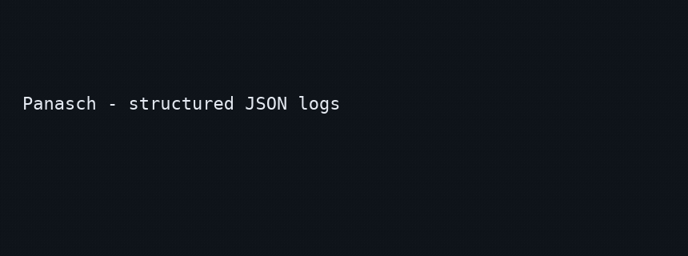

# Panasch

Zero-dependency structured logger for Node, Bun, Deno, and edge runtimes.



**Stage 1:** Pino-style calls, async context + correlation IDs, redaction defaults, optional OpenTelemetry trace hook.

**Stage 2:** Token-efficient sinks (`logfmt`, `compact`), dedup summarization, `gen_ai.*` helpers, MCP log capture + SQL-ish queries. Skill: `skills/panasch-logging/SKILL.md`.

**Stage 3 (shipped):** Pino/Winston **codemod**, local **playground**, and README **demo GIF** (regenerate with `yarn generate:demo-gif`).

**Later (not in this repo):** npm publish under the Panasch name, framework default integrations (Hono/Nitro/Nuxt PRs), `llms.txt` / MCP docs server, launch benchmarks + coordinated HN/X post.

## Install (local package)

```bash
git clone https://github.com/ikrishg/panasch.git
cd panasch
yarn install && yarn build
```

```bash
npm install /path/to/panasch
```

The `package.json` name is still `trevenant` until a release is published.

## Quick start

```js
import { createLogger, runWithContext } from 'trevenant'
import { installNodeContext } from 'trevenant/context/node'

installNodeContext()

const log = createLogger({ level: 'info', name: 'api' })

runWithContext({ requestId: 'req-1' }, () => {
  log.info({ userId: 'u1' }, 'fetched profile')
})
```

## Stage 3: codemod (Pino / Winston)

Best-effort migration — review diffs before committing.

```bash
yarn build
yarn codemod --from pino --write ./src
# or
yarn codemod --from winston ./src/logger.ts
```

Patterns covered: `import pino from 'pino'`, `pino()`, `winston.createLogger()`, and similar. Not every transport or plugin API maps to Panasch.

## Stage 3: playground

```bash
yarn build
yarn playground
# open http://localhost:4173/playground/
```

Try JSON / logfmt / compact output, dedup, and gen_ai logging in the browser.

## Stage 2: token-efficient output

```js
const log = createLogger({
  format: 'logfmt',
  dedup: true,
  capture: true
})
```

## Stage 2: gen_ai helpers

```js
import { logGenAiChat, logGenAiToolCall } from 'trevenant/ai'
```

## Stage 2: MCP log server

```bash
yarn mcp
```

Requires `@modelcontextprotocol/sdk` and `createLogger({ capture: true })` in your app.

## Pino-style API, redaction, OpenTelemetry

`log.info(obj, msg)`, `child()`, default redaction, optional `setOtelTraceHook` + `otel: true`.

## Class API (`Panasch`)

`Panasch` / `Trevenant` remain as a thin chainable wrapper.

## License

MIT
